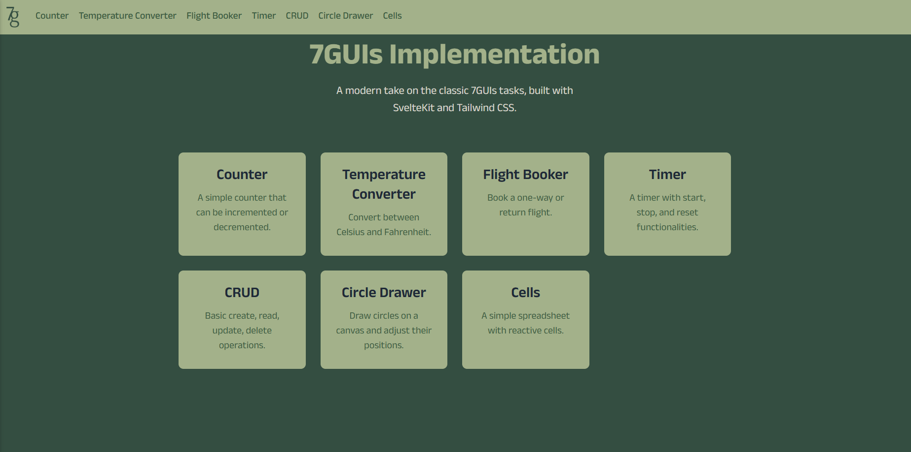

# 7guis

---

[](https://opensource.org/licenses/MIT)

This project is the implementation of the [7 GUIs](https://eugenkiss.github.io/7guis/) tasks in SvelteKit.



The main point of this project is for me to learn SvelteKit and how to build a website with it. If you find any issue or 
have any suggestions, please feel free to open an issue or a pull request.

## Installation

If you wish to build the project locally and see what my website looks like, you can run the following command to first
get my project on your system:

```bash
git clone https://github.com/Shayan1503/7guis.git
cd 7guis
```

Install the dependencies with `npm install` (or `pnpm install` or `yarn`) and start the development server:

```bash
npm run dev -- --open
```

In case the website doesn't open automatically, you can open it manually by going to `http://localhost:3000` on your browser.